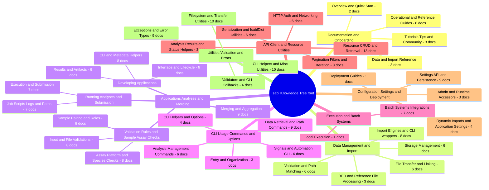

# Isabl Knowledge Tree

```mermaid
mindmap
  root((Isabl Knowledge Tree root))
    Documentation and Onboarding
      Overview and Quick Start - 2 docs
      Tutorials Tips and Community - 3 docs
      Data and Import Reference - 3 docs
      Operational and Reference Guides - 6 docs
    Data Management and Import
      Import Engines and CLI wrappers - 8 docs
      Storage Management - 6 docs
      File Transfer and Linking - 6 docs
      BED and Reference File Processing - 3 docs
      Validation and Path Matching - 6 docs
    Applications Analyses and Merging
      Developing Applications
        Interface and Lifecycle - 6 docs
        Results and Artifacts - 6 docs
        CLI and Metadata Helpers - 8 docs
      Running Analyses and Submission
        Execution and Submission - 7 docs
        Job Scripts Logs and Paths - 7 docs
      Merging and Aggregation - 9 docs
      Validation Rules and Sample Assay Checks
        Input and File Validations - 8 docs
        Sample Pairing and Roles - 8 docs
        Assay Platform and Species Checks - 8 docs
    CLI Usage Commands and Options
      Entry and Organization - 3 docs
      Data Retrieval and Path Commands - 9 docs
      Analysis Management Commands - 6 docs
      Signals and Automation CLI - 6 docs
      CLI Helpers and Options - 4 docs
    Execution and Batch Systems
      Batch Systems Integrations - 7 docs
      Local Execution - 1 docs
    API Client and Resource Utilities
      HTTP Auth and Networking - 6 docs
      Resource CRUD and Retrieval - 13 docs
      Pagination Filters and Iteration - 3 docs
      Serialization and IsablDict Utilities - 6 docs
      Analysis Results and Status Helpers - 3 docs
    Configuration Settings and Deployment
      Settings API and Persistence - 9 docs
      Dynamic Imports and Application Settings - 4 docs
      Admin and Runtime Accessors - 3 docs
      Deployment Guides - 1 docs
    Utilities Validation and Errors
      Exceptions and Error Types - 9 docs
      Filesystem and Transfer Utilities - 10 docs
      CLI Helpers and Misc Utilities - 10 docs
      Validators and CLI Callbacks - 4 docs
```
