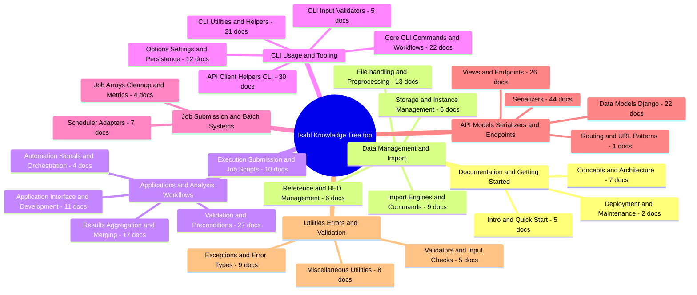

# Isabl Knowledge Tree

```mermaid
mindmap
  root((Isabl Knowledge Tree top))
    Documentation and Getting Started
      Intro and Quick Start - 5 docs
      Concepts and Architecture - 7 docs
      Deployment and Maintenance - 2 docs
    Data Management and Import
      Import Engines and Commands - 9 docs
      File handling and Preprocessing - 13 docs
      Storage and Instance Management - 6 docs
      Reference and BED Management - 6 docs
    Applications and Analysis Workflows
      Application Interface and Development - 11 docs
      Execution Submission and Job Scripts - 10 docs
      Results Aggregation and Merging - 17 docs
      Validation and Preconditions - 27 docs
      Automation Signals and Orchestration - 4 docs
    CLI Usage and Tooling
      Core CLI Commands and Workflows - 22 docs
      Options Settings and Persistence - 12 docs
      CLI Utilities and Helpers - 21 docs
      API Client Helpers CLI - 30 docs
      CLI Input Validators - 5 docs
    Job Submission and Batch Systems
      Scheduler Adapters - 7 docs
      Job Arrays Cleanup and Metrics - 4 docs
    API Models Serializers and Endpoints
      Data Models Django - 22 docs
      Serializers - 44 docs
      Views and Endpoints - 26 docs
      Routing and URL Patterns - 1 docs
    Utilities Errors and Validation
      Exceptions and Error Types - 9 docs
      Validators and Input Checks - 5 docs
      Miscellaneous Utilities - 8 docs
```
